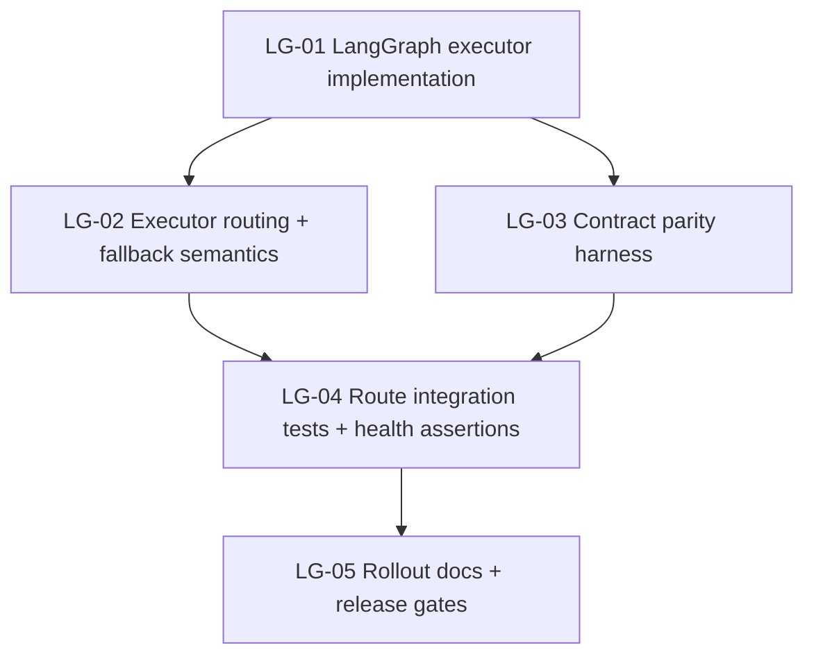

# micro-ui-agent-builder — Next required changes for LangGraph + Langfuse integration

## 0) Context-grounded instruction outline

- Confirm design target from PRD: **LangGraph orchestration parity** + **Langfuse observability** behind fail-safe runtime flags.
- Identify what is already implemented vs. still blocked using current runtime files.
- Define the **next executable change set only** (no scope expansion), with explicit dependencies.
- Keep rollout fail-closed behavior until parity + regression tests pass.

## 1) Baseline status (evidence-based)

### Implemented now

- Runtime config and guardrails for orchestration/telemetry flags exist (`ORCHESTRATION_BACKEND`, `TELEMETRY_PROVIDER`, health status, fail-closed errors).  
  Source: `apps/web/lib/server/runtime-config.ts`.
- Route handlers already call orchestration executor abstraction (`/api/agent/run`, `/api/agent/genui`).  
  Source: `apps/web/app/api/agent/run/route.ts`, `apps/web/app/api/agent/genui/route.ts`.
- Langfuse telemetry provider, no-op provider, trace helpers, and tool wrappers are implemented and wired through current AI SDK executor path.  
  Source: `apps/web/lib/server/telemetry/*`, `apps/web/lib/server/orchestration/current-ai-sdk-executor.ts`.

### Not implemented / blocking full design completion

1. **No LangGraph executor implementation** (`langgraph-executor.ts` absent).
2. **Executor resolver does not branch on `ORCHESTRATION_BACKEND=langgraph` to a concrete executor** (currently only AI SDK executor registry by internal flag).
3. **No parity harness that compares AI SDK vs LangGraph response envelopes/stream semantics across representative fixtures.**
4. **No route-level integration tests validating LangGraph success/fallback/error contract once enabled.**
5. **Rollout docs still describe LangGraph as pending/fail-closed; cutover checklist is not codified as executable release gates.**

## 2) Success metric for this change set (TDD-first)

The LangGraph/Langfuse integration is considered fully implemented only when all are true:

- `ORCHESTRATION_BACKEND=langgraph` executes via a real LangGraph executor for both `/api/agent/run` and `/api/agent/genui`.
- Existing API contracts (status codes, JSON envelope, streaming/tool behavior) remain backward-compatible for current clients.
- Telemetry emits correlated traces/events for both executors using the same `traceId`/`runId` contract.
- Runtime health + rollout checks provide deterministic readiness and rollback guidance.
- Quality gates pass: lint, typecheck, tests, build.

## 3) Planned workstreams (next required set)

### LG-01 — Implement LangGraph executor

- Create `apps/web/lib/server/orchestration/langgraph-executor.ts` implementing `OrchestrationRouteExecutor`.
- Port current AI SDK execution stages into graph nodes (request parse/validate, store load, prompt assembly, preflight, model/tool execution, completion/error mapping).
- Preserve response/error contract for run/genui routes.

### LG-02 — Wire backend routing by `ORCHESTRATION_BACKEND`

- Update orchestration resolver to select AI SDK or LangGraph executor from runtime config.
- Keep fail-closed behavior for missing LangGraph env and explicit fallback to AI SDK only when configured.
- Maintain existing `AGENT_ORCHESTRATION_EXECUTOR` behavior on AI SDK path only.

### LG-03 — Add parity harness tests

- Add fixture-based tests for representative scenarios:
  - valid run with tools,
  - preflight rejection,
  - model fallback path,
  - genui success/failure.
- Assert envelope parity and stable error semantics between current AI SDK executor and LangGraph executor.

### LG-04 — Add route integration and runtime health checks

- Add route tests proving:
  - `ORCHESTRATION_BACKEND=ai_sdk` keeps current behavior,
  - `ORCHESTRATION_BACKEND=langgraph` uses new executor,
  - invalid/missing config returns expected 503 remediation messages.
- Extend health endpoint tests for LangGraph-ready vs not-ready states.

### LG-05 — Finalize rollout docs and release gates

- Update `docs/agents.md` and PRD status sections from “pending” to “implemented” only when parity/test gates pass.
- Add explicit production cutover checklist:
  1. deploy with backend `ai_sdk`,
  2. verify health,
  3. canary `langgraph`,
  4. observe Langfuse traces,
  5. full rollout,
  6. rollback trigger criteria.

## 4) Executable task stubs

:::task-stub{title="micro-ui-agent-builder-LangGraphLangfuse-LG01-ImplementLangGraphExecutor"}
1. Add `apps/web/lib/server/orchestration/langgraph-executor.ts` implementing `executeRun` and `executeGenUi`.
2. Map current runtime stages to graph nodes and preserve route response schema.
3. Reuse telemetry hooks (`beginRouteTrace`, `failTrace`, tool/model events) to keep trace contract stable.
:::

:::task-stub{title="micro-ui-agent-builder-LangGraphLangfuse-LG02-BackendResolverRouting"}
1. Update `apps/web/lib/server/orchestration/executor.ts` to branch by `getServerRuntimeConfig().orchestrationBackend`.
2. Keep `langgraph` fail-closed if executor unavailable or required env missing.
3. Keep `AGENT_ORCHESTRATION_EXECUTOR` resolution scoped to AI SDK backend only.
:::

:::task-stub{title="micro-ui-agent-builder-LangGraphLangfuse-LG03-ParityHarness"}
1. Add fixture-based executor parity tests under `apps/web/lib/server/orchestration/`.
2. Validate run/genui payloads, status codes, and fallback/error parity.
3. Include tool-loop and knowledge-enabled flow fixtures.
:::

:::task-stub{title="micro-ui-agent-builder-LangGraphLangfuse-LG04-RouteAndHealthTests"}
1. Extend route tests in `apps/web/app/api/agent/run/route.test.ts` and `apps/web/app/api/agent/genui/route.test.ts` for backend selection.
2. Add runtime health tests for all backend/provider readiness states.
3. Assert exact remediation messages for invalid config branches.
:::

:::task-stub{title="micro-ui-agent-builder-LangGraphLangfuse-LG05-RolloutDocsAndReleaseGates"}
1. Update `docs/agents.md` and `docs/micro-ui-agent-builder-future-ai-stack-prd.md` status sections.
2. Add explicit release gate checklist tied to lint/typecheck/test/build + runtime health + Langfuse trace verification.
3. Document rollback trigger thresholds and owner actions.
:::

## 5) Improvement proposals (scoped)

- `#refactor` Split `current-ai-sdk-executor.ts` into stage-level services (`request`, `preflight`, `model-runner`, `response-mapper`) to simplify parity testing and LangGraph node reuse.
- `#tech-debt` Add deterministic telemetry assertions (trace/model/tool events) in tests to prevent silent observability regressions across executors.
- `#upkeep` Centralize runtime error/remediation strings in one module to keep route + health responses consistent.
- `#other` Add a canary script for backend flip validation (`ai_sdk` vs `langgraph`) to reduce manual rollout risk.

## 6) Clarifications required before coding LG-01

1. LangGraph deployment target: hosted LangGraph Cloud endpoint vs self-hosted API?
2. Required streaming parity level: token-by-token fidelity vs envelope-only compatibility?
3. Expected rollback policy: automatic fallback to `ai_sdk` on executor error, or strict fail-closed for all LangGraph failures?
4. Langfuse payload policy: include full prompt/tool inputs or redact-sensitive fields by default?
