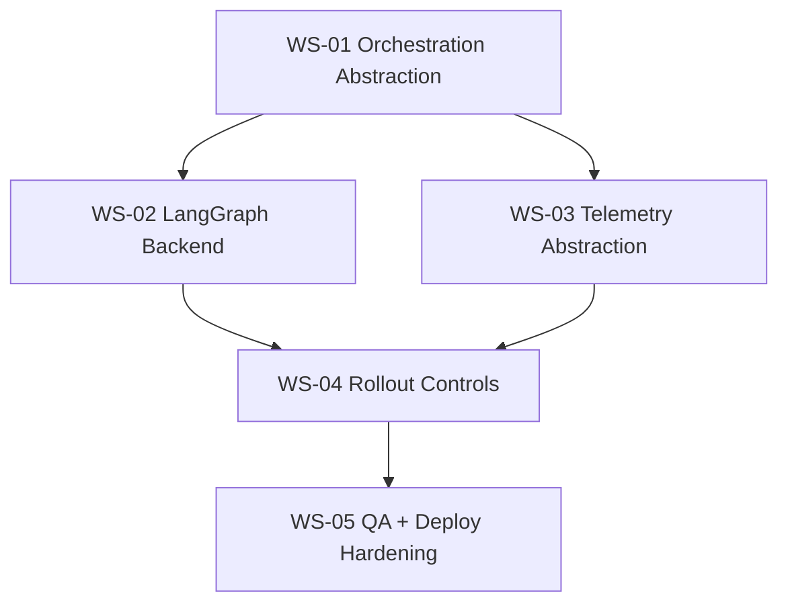

# MicroUIAgentBuilder-FutureAIStack-ContextualPRD

## 0) Context-grounded instruction outline

- Establish a migration target: **Next.js App Router + Vercel AI SDK v6 UI streaming + LangGraph orchestration + Langfuse observability** while preserving current product surface (Flows, Run, GenUI, Tools, MCP).
- Keep changes server-first for runtime internals (`app/api/*`, `lib/server/*`) and maintain existing client chat contract (`@ai-sdk/react` + stream transport).
- Introduce orchestration and observability as composable adapters to avoid coupling core route handlers to one implementation.
- Validate with existing quality gates (`pnpm lint`, `pnpm typecheck`, `pnpm test`, `pnpm build`) and define explicit rollout acceptance criteria.

## 1) Problem statement and goals

### Current baseline (from repo)

- Streaming runtime is concentrated in `POST /api/agent/run` using `streamText`, flow preflight, dynamic tools, model resolution, and finish hooks for analytics logs.
- Structured GenUI runtime is exposed via `POST /api/agent/genui` using `generateObject` and shared Zod schema.
- Client chat UX already uses AI SDK UI primitives (`useChat`, `DefaultChatTransport`) and supports tool approval UX and inline GenUI rendering.
- Observability exists as local JSONL run analytics (`appendRunAnalyticsRecord`) and dashboard aggregation; no external tracing layer is present.

### Target outcomes

1. Preserve existing chat UX and streaming behavior while moving orchestration logic into a LangGraph-compatible execution layer.
2. Add Langfuse trace/span/generation telemetry for run + genui routes without exposing secrets client-side.
3. Keep AI SDK v6 as the transport/UI abstraction to minimize front-end churn.
4. Keep flow document schemas backward-compatible while enabling optional graph-derived execution metadata.

### Non-goals

- Replacing the current Studio flow editor data model.
- Replacing `@repo/shared` GenUI schema contracts.
- Introducing client-side secret handling or browser-side tracing ingestion.

## 2) Proposed architecture (incremental)

### A. Runtime layering

- **Presentation layer (unchanged first):** `RunChatConversation` + AI SDK UI transport.
- **API boundary (minimal change):** existing route handlers remain entry points.
- **Execution adapter (new):** `lib/server/orchestration/*` with an interface:
  - `executeChatRun(request): AsyncIterable<UIMessageChunk>`
  - `executeGenuiRun(request): Promise<GenuiSurface>`
- **Implementation v1:** wraps existing `streamText`/`generateObject` behavior.
- **Implementation v2:** LangGraph-backed adapter preserving input/output shapes.

### B. Observability layering

- **Telemetry adapter (new):** `lib/server/telemetry/*` abstraction:
  - `startRunTrace`, `recordModelCall`, `recordToolCall`, `finishRunTrace`, `captureError`.
- **Implementation v1:** no-op + existing JSONL analytics.
- **Implementation v2:** Langfuse implementation with environment-gated activation.

### C. Data contracts

- Maintain current request contracts for:
  - `/api/agent/run` (`messages`, `flowId?`, `agentId?`, `preferOllama?`)
  - `/api/agent/genui` (`instruction`, `flowId?`, `agentId?`)
- Add optional metadata fields only when strictly additive (e.g., `orchestrationVersion`, `traceId`) and keep clients tolerant.

## 3) Current implementation status

### Orchestration flags — single source of truth

| Variable | Allowed values | Purpose | Current effect |
|----------|----------------|---------|----------------|
| `ORCHESTRATION_BACKEND` | `ai_sdk` (default), `langgraph` | Runtime config gate for route execution backend selection. | `ai_sdk` executes via current AI SDK path. `langgraph` is currently **fail-closed** for route execution until a LangGraph executor is shipped. |
| `AGENT_ORCHESTRATION_EXECUTOR` | `current-ai-sdk` (default), `next-ai-sdk` | Internal executor selector used by orchestration resolver. | Both values currently resolve to the same `CurrentAiSdkOrchestrationExecutor` implementation (AI SDK executor contract parity flag). |
| `LANGGRAPH_API_URL` | non-empty URL | LangGraph endpoint for remote execution. | Required when `ORCHESTRATION_BACKEND=langgraph`; missing value fails closed. |
| `LANGGRAPH_API_KEY` | non-empty secret | LangGraph auth for remote execution. | Required when `ORCHESTRATION_BACKEND=langgraph`; missing value fails closed. |

**Precedence note**

1. `ORCHESTRATION_BACKEND` is evaluated first and gates route backend eligibility.
2. `AGENT_ORCHESTRATION_EXECUTOR` is only relevant when backend resolution stays on the AI SDK path.
3. If backend resolution is `langgraph` before LangGraph executor support exists (or required LangGraph env is missing), startup/request execution fails closed; executor selector does not override that gate.

**Startup behavior examples (missing/invalid values)**

- `ORCHESTRATION_BACKEND` unset → defaults to `ai_sdk`; runtime uses AI SDK execution path.
- `ORCHESTRATION_BACKEND=invalid` → runtime rejects backend config (503 fail-closed) with remediation guidance.
- `ORCHESTRATION_BACKEND=langgraph` with missing `LANGGRAPH_API_URL` or `LANGGRAPH_API_KEY` → fail-closed (503) with explicit missing-variable guidance.
- `AGENT_ORCHESTRATION_EXECUTOR` unset → defaults to `current-ai-sdk`.
- `AGENT_ORCHESTRATION_EXECUTOR=unknown` with `ORCHESTRATION_BACKEND=ai_sdk` → resolver falls back to `current-ai-sdk`.

**Migration note (when `langgraph-executor.ts` is introduced)**

- After `apps/web/lib/server/orchestration/langgraph-executor.ts` is added, update this table so `ORCHESTRATION_BACKEND=langgraph` maps to the real executor path, document any new `AGENT_ORCHESTRATION_EXECUTOR` values, and keep `ai_sdk` as rollback target until parity checks pass.

### Workstream status snapshot

- **WS-01 — Orchestration abstraction and parity harness: Implemented**
  - Implemented orchestration resolver and runtime abstraction in:
    - `apps/web/lib/server/orchestration/executor.ts`
    - `apps/web/lib/server/orchestration/current-ai-sdk-executor.ts`
- **WS-02 — LangGraph execution backend: Pending**
  - `apps/web/lib/server/orchestration/langgraph-executor.ts` does **not** exist yet (therefore `ORCHESTRATION_BACKEND=langgraph` remains fail-closed by design).
- **WS-03 — Langfuse telemetry backend: Implemented**
  - Implemented telemetry abstraction/provider stack in:
    - `apps/web/lib/server/telemetry/types.ts`
    - `apps/web/lib/server/telemetry/provider.ts`
    - `apps/web/lib/server/telemetry/noop.ts`
    - `apps/web/lib/server/telemetry/langfuse.ts`
    - `apps/web/lib/server/telemetry/with-trace.ts`
    - `apps/web/lib/server/telemetry/tool-wrap.ts`
  - Runtime health endpoint present at:
    - `apps/web/app/api/runtime/health/route.ts`
- **WS-04 — Progressive rollout + fallback controls: In progress**
- **WS-05 — QA, reliability, and deployment hardening: In progress**

## 4) Change-set plan with workstreams

### WS-01 — Orchestration abstraction and parity harness

- Build a stable orchestration interface around current server logic.
- Add parity checks to ensure output/tool behavior matches current routes.

### WS-02 — LangGraph execution backend

- Implement LangGraph executor for chat/genui workflows.
- Map existing flow preflight + tool registration + model selection into graph nodes.

### WS-03 — Langfuse telemetry backend

- Add server-only telemetry adapter and emit traces/spans around route executions and tool/model calls.

#### Langfuse event contract

This contract defines the minimum telemetry shape required to correlate a single Run/GenUI request across API logs, model events, and tool execution.

**Trace lifecycle (`beginRouteTrace` → `finishTrace`)**

1. **Trace start** (`beginRouteTrace`) initializes `traceId` (request header `x-trace-id` or generated UUID) and `runId`, then calls `telemetry.startTrace(...)` with `kind`, `flowId`, `agentId`, and `runId`.
   - Source: `apps/web/lib/server/telemetry/with-trace.ts`
2. **Route/model/tool execution** emits model and tool events from the AI SDK executor.
   - Source: `apps/web/lib/server/orchestration/current-ai-sdk-executor.ts`
3. **Error path** (`failTrace` or explicit catch blocks) records `trace_error` via `captureError(...)` then closes the trace with `finishTrace(..., "error")`.
   - Sources: `apps/web/lib/server/telemetry/with-trace.ts`, `apps/web/lib/server/orchestration/current-ai-sdk-executor.ts`
4. **Success path** closes trace with `finishTrace(..., "ok")` and duration metadata.
   - Source: `apps/web/lib/server/orchestration/current-ai-sdk-executor.ts`

**Emitted event names and producers**

- `model_preflight` — emitted by `recordModelEvent({ phase: "preflight" })` in `apps/web/lib/server/orchestration/current-ai-sdk-executor.ts`; event naming materialized in `apps/web/lib/server/telemetry/langfuse.ts`.
- `model_selection` — emitted by `recordModelEvent({ phase: "model_selection" })` in `apps/web/lib/server/orchestration/current-ai-sdk-executor.ts`; event naming materialized in `apps/web/lib/server/telemetry/langfuse.ts`.
- `model_generation_start` — emitted by `recordModelEvent({ phase: "generation_start" })` in `apps/web/lib/server/orchestration/current-ai-sdk-executor.ts`; event naming materialized in `apps/web/lib/server/telemetry/langfuse.ts`.
- `model_generation_finish` — emitted by `recordModelEvent({ phase: "generation_finish" })` in `apps/web/lib/server/orchestration/current-ai-sdk-executor.ts`; event naming materialized in `apps/web/lib/server/telemetry/langfuse.ts`.
- `tool_*` (`tool_tool_call_start`, `tool_tool_call_finish`, `tool_tool_call_error`) — emitted by tool wrappers in `apps/web/lib/server/telemetry/tool-wrap.ts`; event naming materialized in `apps/web/lib/server/telemetry/langfuse.ts`; wrapper integration occurs in `apps/web/lib/server/orchestration/current-ai-sdk-executor.ts`.
- `trace_error` — emitted by `captureError(...)` in `apps/web/lib/server/telemetry/langfuse.ts`; invoked from `failTrace(...)` in `apps/web/lib/server/telemetry/with-trace.ts` and explicit executor catch blocks in `apps/web/lib/server/orchestration/current-ai-sdk-executor.ts`.

**Minimum required debugging correlation fields**

Every trace/event payload must include enough metadata to join telemetry with request and analytics logs.

- `traceId` (required): primary correlation key across API response metadata (`x-trace-id` / response metadata) and telemetry.
- `runId` (required): per-request execution identifier generated at route start.
- `flowId` (required, nullable): flow context for route-level grouping.
- `agentId` (required, nullable): agent context for route-level grouping.
- Provider/model labels (required on model events):
  - `providerLabel` (selected execution provider)
  - `modelRef` (requested/resolved model reference)
  - `fallbackProviderLabel` (when fallback path is available/used)

Implementation note: `startTrace` currently seeds `flowId` and `agentId` as `null` in `beginRouteTrace`; preserving these keys as explicit nullable fields is part of the contract.

### WS-04 — Progressive rollout + fallback controls

- Add feature flags for executor and telemetry selection with safe default behavior.
- Keep rollback path to current runtime.

### WS-05 — QA, reliability, and deployment hardening

- Extend tests for adapter behavior and run/build checks.
- Validate Vercel/serverless compatibility and secret scoping.



## 5) Executable task stubs

:::task-stub{title="micro-ui-agent-builder-FutureAIStack-WS01-OrchestrationInterface"}
1. Create `apps/web/lib/server/orchestration/types.ts` with route-facing request/response contracts.
2. Create `apps/web/lib/server/orchestration/executor.ts` interface + resolver by feature flag.
3. Extract current route runtime logic into `apps/web/lib/server/orchestration/current-ai-sdk-executor.ts` without behavior changes.
4. Refactor `app/api/agent/run/route.ts` and `app/api/agent/genui/route.ts` to call the executor.
:::

:::task-stub{title="micro-ui-agent-builder-FutureAIStack-WS02-LangGraphExecutor"}
1. Implement `apps/web/lib/server/orchestration/langgraph-executor.ts`.
2. Model graph nodes for preflight, system prompt build, knowledge augmentation, toolset resolution, model selection, and execution.
3. Ensure node outputs preserve existing API response shape and error semantics.
4. Add parity tests against representative flows (guardrail, tool loop, MCP-enabled).
:::

:::task-stub{title="micro-ui-agent-builder-FutureAIStack-WS03-LangfuseTelemetry"}
1. Add `apps/web/lib/server/telemetry/types.ts` abstraction for tracing events.
2. Add `apps/web/lib/server/telemetry/langfuse.ts` and `noop.ts` implementations.
3. Instrument route lifecycle + model/tool execution boundaries.
4. Propagate `traceId` to server logs and optional API metadata fields.
:::

:::task-stub{title="micro-ui-agent-builder-FutureAIStack-WS04-FeatureFlagsAndRollback"}
1. Define server-only flags for executor and telemetry providers.
2. Add startup validation + safe defaults in non-configured environments.
3. Add operational runbook section in `docs/agents.md` for rollout/rollback.
:::

:::task-stub{title="micro-ui-agent-builder-FutureAIStack-WS05-QAAndRelease"}
1. Add unit tests for executor selection and telemetry gating.
2. Add integration tests for route-level success/failure and fallback paths.
3. Run quality gates: lint, typecheck, test, build.
4. Produce release checklist and post-deploy verification steps.
:::

## 6) Acceptance criteria

### Met now

- **AC-01:** Existing Run chat UX streams responses and tool calls without front-end API contract changes.
- **AC-02:** GenUI route still validates against shared schema and returns same top-level JSON envelope.
- **AC-04:** Langfuse telemetry can be enabled/disabled by configuration with no impact when disabled.
- **AC-05:** Existing analytics JSONL pipeline remains functional during migration.

### Blocked / pending

- **AC-03:** LangGraph executor can be enabled/disabled by configuration with deterministic fallback.  
  _Blocked pending WS-02 implementation; `apps/web/lib/server/orchestration/langgraph-executor.ts` is not present yet._
- **AC-06:** Root quality gates pass in CI and local dev.  
  _Pending full migration completion and verification run for all workstreams._

## 7) Risks and mitigations

- **Risk:** Streaming semantics diverge between current direct `streamText` and LangGraph runner.
  - **Mitigation:** WS-01 parity harness + golden route fixtures before enabling WS-02 by default.
- **Risk:** Duplicate telemetry (JSONL + Langfuse) or missing trace correlation.
  - **Mitigation:** central telemetry adapter with explicit event mapping and traceId propagation.
- **Risk:** Tool approval or MCP tool naming behavior regresses.
  - **Mitigation:** preserve existing tool name normalization and approval event payload contracts.

## 8) Test-first rollout matrix

- **Pre-change baseline tests:** snapshot current route behavior (success, preflight fail, provider fail, tool output).
- **Migration tests:** run same fixtures with LangGraph executor and compare envelope + error shape.
- **Regression tests:** verify existing dashboards still compute from JSONL analytics records.
- **Deployment tests:** Vercel preview with and without Supabase; ensure no server secret leaks to client bundle.

## 9) Improvement proposal backlog (grounded)

- `#refactor` Extract route runtime internals into server services to reduce `route.ts` complexity and improve testability.
- `#tech-debt` Replace ad-hoc `console.log` events with structured telemetry adapter events to align analytics + tracing.
- `#upkeep` Consolidate provider/env capability checks into a single documented configuration contract.
- `#other` Add explicit orchestration state schema for run lifecycle transitions (queued, preflight, model, tool, complete, failed).

## 10) Open questions (required before implementation)

1. Should LangGraph be the default executor immediately after parity, or staged by environment (dev/staging/prod)?
2. Is Langfuse self-hosted or cloud, and what data retention/privacy constraints apply to prompt/tool payload capture?
3. Should existing JSONL analytics remain long-term, or be treated as fallback only once Langfuse is stable?
4. Do we require end-user visible trace IDs in the Studio UI, or only server logs/API metadata?
5. Is there a required compatibility window for old flow definitions if orchestration metadata is added?

## Appendix A) `GET /api/runtime/health` response payloads

The endpoint returns HTTP `200` when `ok: true` and HTTP `503` when `ok: false`.

### A.1 Valid defaults (no orchestration/telemetry env vars set)

```json
{
  "ok": true,
  "config": {
    "orchestrationBackend": "ai_sdk",
    "telemetryProvider": "noop",
    "legacyLangfuseTracingEnabled": false,
    "langgraphConfigured": false,
    "langfuseConfigured": false
  }
}
```

### A.2 Failure: invalid `ORCHESTRATION_BACKEND`

```json
{
  "ok": false,
  "config": {
    "orchestrationBackend": "invalid",
    "telemetryProvider": "noop",
    "legacyLangfuseTracingEnabled": false,
    "langgraphConfigured": false,
    "langfuseConfigured": false
  },
  "error": "Invalid ORCHESTRATION_BACKEND=\"invalid\". Use \"ai_sdk\" (default) or \"langgraph\"."
}
```

Remediation: set `ORCHESTRATION_BACKEND=ai_sdk` (default) or `ORCHESTRATION_BACKEND=langgraph`.

### A.3 Failure: invalid `TELEMETRY_PROVIDER`

```json
{
  "ok": false,
  "config": {
    "orchestrationBackend": "ai_sdk",
    "telemetryProvider": "invalid",
    "legacyLangfuseTracingEnabled": false,
    "langgraphConfigured": false,
    "langfuseConfigured": false
  },
  "error": "Invalid TELEMETRY_PROVIDER=\"invalid\". Use \"noop\" (default) or \"langfuse\"."
}
```

Remediation: set `TELEMETRY_PROVIDER=noop` (default) or `TELEMETRY_PROVIDER=langfuse`.

### A.4 Failure: missing Langfuse keys when enabled

```json
{
  "ok": false,
  "config": {
    "orchestrationBackend": "ai_sdk",
    "telemetryProvider": "langfuse",
    "legacyLangfuseTracingEnabled": false,
    "langgraphConfigured": false,
    "langfuseConfigured": false
  },
  "error": "TELEMETRY_PROVIDER=langfuse requires LANGFUSE_PUBLIC_KEY and LANGFUSE_SECRET_KEY. Set both values or switch TELEMETRY_PROVIDER=noop."
}
```

Remediation: set both `LANGFUSE_PUBLIC_KEY` and `LANGFUSE_SECRET_KEY`, or switch to `TELEMETRY_PROVIDER=noop`.

### A.5 Failure: `LANGFUSE_TRACING_ENABLED=true` + `TELEMETRY_PROVIDER=noop`

```json
{
  "ok": false,
  "config": {
    "orchestrationBackend": "ai_sdk",
    "telemetryProvider": "noop",
    "legacyLangfuseTracingEnabled": true,
    "langgraphConfigured": false,
    "langfuseConfigured": false
  },
  "error": "Conflicting telemetry flags: LANGFUSE_TRACING_ENABLED=true but TELEMETRY_PROVIDER=noop. Set TELEMETRY_PROVIDER=langfuse or disable LANGFUSE_TRACING_ENABLED."
}
```

Remediation: set `TELEMETRY_PROVIDER=langfuse` or disable `LANGFUSE_TRACING_ENABLED`.
